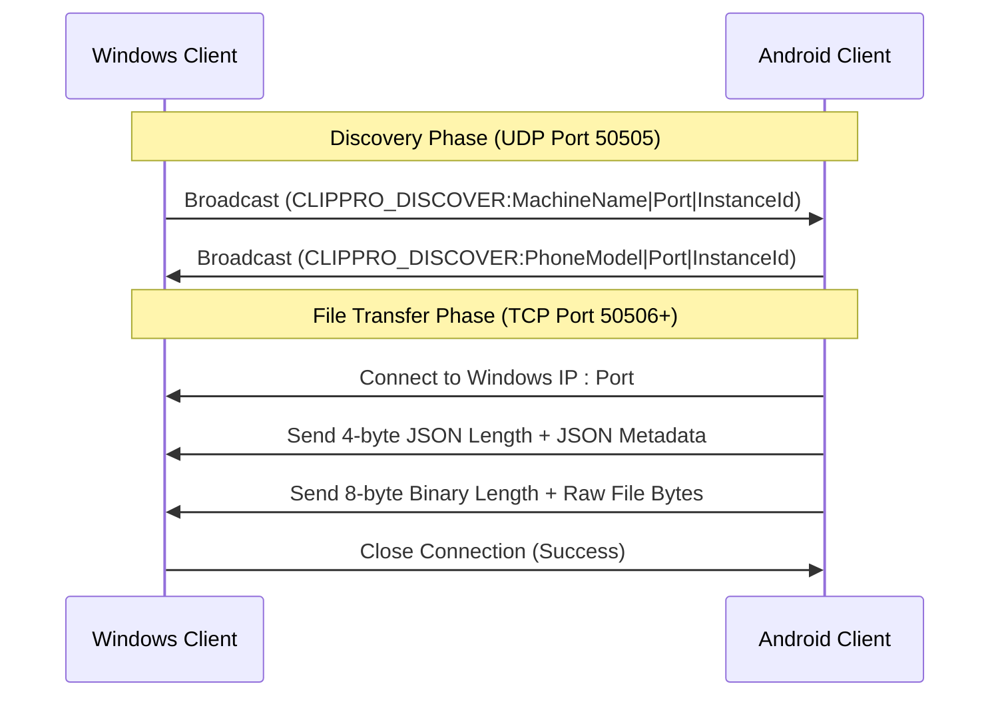

# ClipboardPro - Android Local Share Integration Spec

This specification document outlines the peer-to-peer network protocol used by the ClipboardPro desktop client and provides a step-by-step implementation guide for developing a companion Android application to support local clipboard and file sharing.

---

## 1. Protocol Overview

The Local Share feature relies entirely on a localized Peer-to-Peer (P2P) network. No external cloud servers are used. It consists of two components:
1. **Discovery (UDP Broadcast):** Devices announce their presence and listen for other devices on the local subnet.
2. **Transfer (TCP Socket Connection):** Direct TCP connection is opened between devices to transmit text metadata and binary payloads (such as files and images).



---

## 2. Network Protocol Specifications

### A. UDP Discovery Protocol
* **Port:** `50505` (UDP)
* **Frequency:** Broadcasts sent every `3` seconds.
* **Timeout:** A peer is considered offline if no broadcast packet is received from them for `15` seconds.
* **Payload Format:** Plain UTF-8 string prefixed with a signature:
  ```
  CLIPPRO_DISCOVER:{DeviceName}|{TCPPort}|{InstanceId}
  ```
  * `DeviceName`: Friendly name of the device (e.g., `Pixel 8 Pro` or `Office-PC`).
  * `TCPPort`: The TCP port the device is listening on for incoming transfers (usually starting at `50506`).
  * `InstanceId`: A unique string generated at application startup (e.g., a 8-character random string) to distinguish between multiple instances on the same network and avoid discovering oneself.

#### Android UDP Multicast Constraints:
Android devices block UDP multicast and broadcast packets by default to save battery life. To allow the app to send and receive discovery packets, you **must** acquire a `MulticastLock` from the Android WifiManager.

---

### B. TCP Transfer Protocol
Once a target peer is discovered, a TCP socket is opened directly to their IP and listening port.

The transmission stream consists of the following contiguous fields:

| Field | Data Type | Size / Format | Description |
| :--- | :--- | :--- | :--- |
| **JSON Length** | `Int32` (Little Endian) | 4 bytes | Byte length of the JSON metadata string. |
| **JSON Metadata** | UTF-8 String | Variable | JSON object representing the `ClipboardItem` metadata. |
| **Payload Length** | `Int64` (Little Endian) | 8 bytes | *(Only if Type is Image or Path)* Byte length of the binary payload. |
| **Binary Payload** | Raw Bytes | Variable | *(Only if Type is Image or Path)* The raw file contents. |

#### JSON Metadata Structure
The JSON payload must serialize properties that match the C# `ClipboardItem` model:

```json
{
  "Id": "a1b2c3d4-e5f6-7a8b-9c0d-e1f2a3b4c5d6",
  "Content": "Hello World or filename.jpg",
  "Type": 0,
  "Timestamp": "2026-06-07T10:45:00.1234567+06:00",
  "ImagePath": null
}
```

* **Type Mapping (Enum Integers):**
  * `0` = Text
  * `1` = Image
  * `2` = URL
  * `3` = Email
  * `4` = Phone
  * `5` = Code
  * `6` = Color
  * `7` = Path (Used for Files)
  * `8` = Directory (Not supported on Android directly; block or zip)

---

## 3. Android Application Architecture

To run these network tasks reliably on Android, the application should follow a Service-oriented architecture:

```
+--------------------------------------------------------------+
|                     Jetpack Compose UI                       |
|  (Device List View, File Picker, Transfer Progress Overlay)  |
+------------------------------+-------------------------------+
                               | Binds to/Controls
                               v
+--------------------------------------------------------------+
|               Foreground Service (LocalShareService)          |
|  * Manages Notification (to prevent Android OS process kill)  |
|  * Holds WifiManager.MulticastLock                           |
|  * Starts/Stops Background Network Threads                    |
+---------+------------------------------------------+---------+
          |                                          |
          v                                          v
+------------------+                       +------------------+
| UDP Discovery    |                       | TCP Listener     |
| (Broadcast &     |                       | (Accepts incoming|
|  Listen Tasks)   |                       |  files/texts)    |
+------------------+                       +------------------+
```

### Required Android Permissions
Add these permissions to `AndroidManifest.xml`:
```xml
<!-- Network Permissions -->
<uses-permission android:name="android.permission.INTERNET" />
<uses-permission android:name="android.permission.ACCESS_NETWORK_STATE" />
<uses-permission android:name="android.permission.ACCESS_WIFI_STATE" />
<uses-permission android:name="android.permission.CHANGE_WIFI_MULTICAST_STATE" />

<!-- Background execution & startup -->
<uses-permission android:name="android.permission.FOREGROUND_SERVICE" />
<uses-permission android:name="android.permission.FOREGROUND_SERVICE_DATA_SYNC" />
<uses-permission android:name="android.permission.POST_NOTIFICATIONS" />
```

---

## 4. Kotlin Implementation Code Templates

### A. Acquiring Multicast Lock (UDP broadcast support)
Execute this when starting the background networking service:

```kotlin
val wifiManager = applicationContext.getSystemService(Context.WIFI_SERVICE) as WifiManager
val multicastLock = wifiManager.createMulticastLock("ClipboardProLock").apply {
    setReferenceCounted(true)
    acquire()
}

// Remember to release it when the service stops:
// if (multicastLock.isHeld) multicastLock.release()
```

---

### B. UDP Peer Discovery Implementation
This component broadcasts the phone's presence and listens for other devices.

```kotlin
import java.net.DatagramPacket
import java.net.DatagramSocket
import java.net.InetAddress
import java.net.SocketTimeoutException

class DiscoveryManager(
    private val deviceName: String,
    private val tcpPort: Int,
    private val instanceId: String,
    private val onPeerUpdated: (List<PeerDevice>) -> Unit
) {
    private var socket: DatagramSocket? = null
    private val discoveredPeers = ConcurrentHashMap<String, PeerDevice>()
    private var isRunning = false

    fun start() {
        isRunning = true
        socket = DatagramSocket(50505).apply {
            broadcast = true
            soTimeout = 1000 // 1-second receive timeout for loop cancellation check
        }

        // 1. Thread for Listening for Broadcasters
        Thread { listenLoop() }.start()

        // 2. Thread for Broadcasting Presence
        Thread { broadcastLoop() }.start()
    }

    private fun listenLoop() {
        val buffer = ByteArray(1024)
        while (isRunning) {
            try {
                val packet = DatagramPacket(buffer, buffer.length)
                socket?.receive(packet)
                val message = String(packet.data, 0, packet.length, Charsets.UTF_8)
                
                if (message.startsWith("CLIPPRO_DISCOVER:")) {
                    val payload = message.substring("CLIPPRO_DISCOVER:".length)
                    val parts = payload.split("|")
                    if (parts.size >= 3) {
                        val peerName = parts[0]
                        val peerPort = parts[1].toIntOrNull() ?: continue
                        val peerId = parts[2]
                        val peerIp = packet.address.hostAddress ?: continue

                        if (peerId != instanceId) {
                            val key = "$peerIp:$peerPort"
                            discoveredPeers[key] = PeerDevice(
                                name = peerName,
                                ip = peerIp,
                                port = peerPort,
                                lastSeen = System.currentTimeMillis()
                            )
                            onPeerUpdated(discoveredPeers.values.toList())
                        }
                    }
                }
            } catch (e: SocketTimeoutException) {
                // Safe timeout to check loop flag
                cleanupDeadPeers()
            } catch (e: Exception) {
                if (!isRunning) break
            }
        }
    }

    private fun broadcastLoop() {
        val broadcastAddress = InetAddress.getByName("255.255.255.255")
        val messageBytes = "CLIPPRO_DISCOVER:$deviceName|$tcpPort|$instanceId".toByteArray(Charsets.UTF_8)
        
        while (isRunning) {
            try {
                val packet = DatagramPacket(messageBytes, messageBytes.size, broadcastAddress, 50505)
                socket?.send(packet)
            } catch (e: Exception) {
                // Handle interface down or permission failure
            }
            Thread.sleep(3000)
        }
    }

    private fun cleanupDeadPeers() {
        val now = System.currentTimeMillis()
        val changed = discoveredPeers.values.removeIf { now - it.lastSeen > 15000 }
        if (changed) {
            onPeerUpdated(discoveredPeers.values.toList())
        }
    }

    fun stop() {
        isRunning = false
        socket?.close()
        socket = null
    }
}

data class PeerDevice(
    val name: String,
    val ip: String,
    val port: Int,
    val lastSeen: Long
)
```

---

### C. TCP File Receiver Implementation
The TCP Listener accepts incoming files and saves them to local storage.

```kotlin
import java.io.BufferedInputStream
import java.io.DataInputStream
import java.io.File
import java.io.FileOutputStream
import java.net.ServerSocket
import org.json.JSONObject

class FileReceiver(
    private val port: Int,
    private val saveDirectory: File,
    private val onTransferProgress: (fileName: String, progress: Int, status: String) -> Unit
) {
    private var serverSocket: ServerSocket? = null
    private var isRunning = false

    fun start() {
        isRunning = true
        serverSocket = ServerSocket(port)
        
        Thread {
            while (isRunning) {
                try {
                    val clientSocket = serverSocket?.accept() ?: continue
                    Thread { handleClient(clientSocket) }.start()
                } catch (e: Exception) {
                    if (!isRunning) break
                }
            }
        }.start()
    }

    private fun handleClient(socket: java.net.Socket) {
        socket.use { s ->
            val dis = DataInputStream(BufferedInputStream(s.getInputStream()))
            
            // 1. Read JSON Length (Little Endian conversion)
            val jsonLen = Integer.reverseBytes(dis.readInt())
            if (jsonLen <= 0 || jsonLen > 100 * 1024 * 1024) return

            // 2. Read JSON String
            val jsonBytes = ByteArray(jsonLen)
            dis.readFully(jsonBytes)
            val jsonStr = String(jsonBytes, Charsets.UTF_8)
            val metadata = JSONObject(jsonStr)
            
            val type = metadata.getInt("Type")
            val content = metadata.getString("Content")
            
            // 3. Handle Text / URL Sharing
            if (type == 0 || type == 2) {
                onTransferProgress(content, 100, "Received Text")
                // Copy to Android System Clipboard here
                return
            }

            // 4. Handle File Transfers (Type 7 = Path, Type 1 = Image)
            if (type == 1 || type == 7) {
                // Read Binary Payload Length (Little Endian long conversion)
                val payloadLen = java.lang.Long.reverseBytes(dis.readLong())
                if (payloadLen < 0) return

                val fileName = if (type == 1) "sync_${System.currentTimeMillis()}.png" else File(content).name
                val targetFile = File(saveDirectory, fileName)
                
                FileOutputStream(targetFile).use { fos ->
                    val buffer = ByteArray(81920) // 80KB chunk buffer
                    var totalRead: Long = 0
                    
                    while (totalRead < payloadLen) {
                        val toRead = Math.min(buffer.size.toLong(), payloadLen - totalRead).toInt()
                        val read = dis.read(buffer, 0, toRead)
                        if (read == -1) break
                        
                        fos.write(buffer, 0, read)
                        totalRead += read
                        
                        val percentage = ((totalRead * 100) / payloadLen).toInt()
                        onTransferProgress(fileName, percentage, "Receiving...")
                    }
                }
                onTransferProgress(fileName, 100, "Completed")
            }
        }
    }

    fun stop() {
        isRunning = false
        serverSocket?.close()
        serverSocket = null
    }
}
```

---

### D. TCP File Sender Implementation
To send a file from Android to Windows:

```kotlin
import java.io.BufferedOutputStream
import java.io.DataOutputStream
import java.io.File
import java.io.FileInputStream
import java.net.Socket
import java.util.UUID
import org.json.JSONObject

fun sendFileToPeer(peerIp: String, peerPort: Int, fileToSend: File, onProgress: (Int) -> Unit): Boolean {
    return try {
        Socket(peerIp, peerPort).use { socket ->
            val dos = DataOutputStream(BufferedOutputStream(socket.getOutputStream()))
            
            // 1. Prepare JSON Metadata
            val metadata = JSONObject().apply {
                put("Id", UUID.randomUUID().toString())
                put("Content", fileToSend.name)
                put("Type", 7) // 7 = Path (File transfer)
                put("Timestamp", "2026-06-07T12:00:00.000Z")
            }
            
            val jsonBytes = metadata.toString().toByteArray(Charsets.UTF_8)
            
            // Send JSON length (converted to Little Endian)
            dos.writeInt(Integer.reverseBytes(jsonBytes.size))
            // Send JSON payload
            dos.write(jsonBytes)
            
            // 2. Send File Payload
            val fileLength = fileToSend.length()
            // Send binary length (converted to Little Endian)
            dos.writeLong(java.lang.Long.reverseBytes(fileLength))
            
            // Stream raw bytes
            FileInputStream(fileToSend).use { fis ->
                val buffer = ByteArray(81920)
                var totalSent: Long = 0
                var read: Int
                
                while (fis.read(buffer).also { read = it } != -1) {
                    dos.write(buffer, 0, read)
                    totalSent += read
                    val progress = ((totalSent * 100) / fileLength).toInt()
                    onProgress(progress)
                }
            }
            dos.flush()
        }
        true
    } catch (e: Exception) {
        e.printStackTrace()
        false
    }
}
```

---

## 5. UI Layout Design (Jetpack Compose Guidelines)
To match ClipboardPro's sleek, premium glassmorphism dark aesthetic:
* **Background:** Dark Charcoal (`#121212`) with gradients.
* **Accent Color:** Vibrant Teal (`#00F2FE`) or Neon Blue (`#4FACFE`).
* **Visual Components:**
  * **Device Radar:** Circular scanning animation for looking for PC clients.
  * **Active Transfer List:** Dynamic card rows showing progress bars, transmission speeds, and active pauses.

---

## 6. Development Checklist & Roadmap
- [ ] Create `AndroidApp` directory structure (Kotlin Gradle project).
- [ ] Implement `LocalShareService` (Android Foreground Service).
- [ ] Configure `MulticastLock` and `DatagramSocket` discovery loop.
- [ ] Build binary stream readers/writers with Little Endian byte order conversion.
- [ ] Integrate scoped storage path permissions to save incoming images and documents into `Downloads/ClipboardPro/`.
- [ ] Develop Jetpack Compose views for peer discovery list, file send queues, and history logs.
- [ ] Compile and distribute intermediate APK files for multi-device testing.
