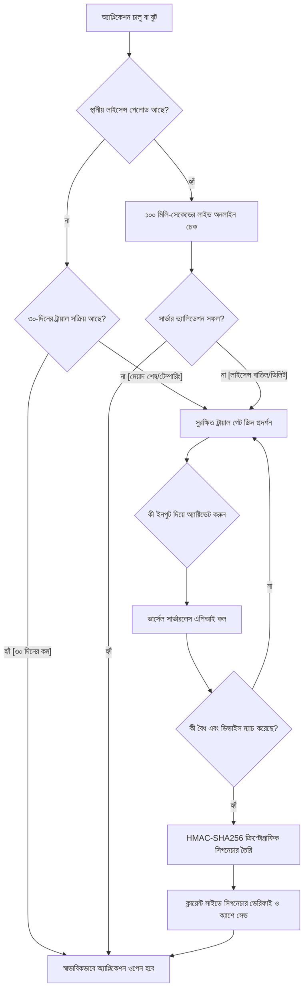

# ClipboardPro Professional — এন্টারপ্রাইজ লাইসেন্স ও কোড সিকিউরিটি আর্কিটেকচার ব্লুপ্রিন্ট

এই ডকুমেন্টটিতে **ClipboardPro Professional**-এর জন্য ডিজাইন, ইমপ্লিমেন্ট ও কম্পাইল করা এন্টারপ্রাইজ-গ্রেড লাইসেন্সিং সিস্টেম, ট্রায়াল ইভ্যালুয়েশন, সেলফ-হিলিং (Self-healing) ডেটা স্টোরেজ, সার্ভারলেস ভ্যালিডেশন ব্যাকএন্ড এবং **Obfuscar** কোড অবফাসকেশন প্রোটেকশনের সম্পূর্ণ ইন-ডেপথ মেকানিজম সংকলন করা হয়েছে।

---

## ১. উচ্চ-স্তরের আর্কিটেকচার ও লাইসেন্স ভেরিফিকেশন ফ্লো (High-Level Verification Loop)

নিচে ক্লিপবোর্ডপ্রো অ্যাপ্লিকেশনের লাইভ গেটিং ও ব্যাকগ্রাউন্ড সিকিউরিটি লুপের ভিজ্যুয়াল ফ্লোচার্ট দেওয়া হলো:



---

## ২. কোড সিকিউরিটি ও এমএসআইএল প্রোটেকশন (C# Code Obfuscation)

ক্র্যাকার বা রিভার্স-ইঞ্জিনিয়াররা যাতে **dnSpy**, **ILSpy** বা **dotPeek** এর মতো ডিকম্পাইলার টুলস ব্যবহার করে অ্যাপ্লিকেশনের সি-শার্প (.NET 10.0 MSIL) কোড উন্মুক্ত করে লাইসেন্স চেকটি বাইপাস বা ডিলিট করতে না পারে, সেজন্য আমরা **Obfuscar** ব্যবহার করে কোড সম্পূর্ণ সুরক্ষিত করেছি।

### ক. অবফুসকার কনফিগারেশন (`obfuscar.xml`)
উইন্ডোজ অ্যাপ্লিকেশনের সমস্ত লাইব্রেরি ফাইল ও মূল এক্সিকিউটেবলকে অবফাসকেশনের মাধ্যমে সুরক্ষিত করতে নিম্নলিখিত প্রোডাকশন রুলস প্রয়োগ করা হয়েছে:

```xml
<?xml version="1.0" encoding="utf-8" ?>
<Obfuscator>
  <!-- ইনপুট ও আউটপুট ডিরেক্টরি পাথ -->
  <Var Name="InPath" Value="." />
  <Var Name="OutPath" Value=".\Obfuscated" />
  
  <!-- প্রধান প্রোটেকশন অপশনস -->
  <Var Name="KeepPublicApi" Value="false" />
  <Var Name="HidePrivateApi" Value="true" />
  <Var Name="RenameProperties" Value="true" />
  <Var Name="RenameEvents" Value="true" />
  <Var Name="RenameFields" Value="true" />
  <Var Name="UseUnicodeNames" Value="true" />
  
  <!-- স্ট্রিং এনক্রিপশন (String Encryption) -->
  <Var Name="EncryptStrings" Value="true" />
  <Var Name="Optimize" Value="true" />
  
  <!-- এক্সক্লুশন রুলস (WPF XAML Binding সামঞ্জস্য বজায় রাখার জন্য) -->
  <Module Name="ClipboardPro.dll">
    <!-- ViewModels এবং Models অক্ষত রাখা হয় যাতে XAML বাইন্ডিং ব্রেক না করে -->
    <SkipType name="ClipboardPro.ViewModels.MainViewModel" />
    <SkipType name="ClipboardPro.Models.AppSettings" />
    <SkipType name="ClipboardPro.Models.ClipboardItem" />
  </Module>
</Obfuscator>
```

### খ. অবফাসকেশন মেকানিজম ব্যাখ্যা:
1. **স্ট্রিং এনক্রিপশন (String Encryption)**: কোডের ভেতরের সমস্ত গুরুত্বপূর্ণ সিক্রেট স্ট্রিং ধ্রুবক (যেমন: Vercel URL, উইন্ডোজ রেজিস্ট্রি কী-র নাম, XOR সাইফার কী, এবং HMAC ডিজিটাল সিগনেচার কীসমূহ) ডিকম্পাইলার থেকে সম্পূর্ণ অদৃশ্য করা হয়। এগুলোকে ক্রিপ্টোগ্রাফিক বাইট-অ্যারেতে রূপান্তরিত করা হয়, যা কেবল রানটাইমে মেমরির ভেতরে ডিক্রিপ্ট হয়।
2. **প্রাইভেট ও ইন্টারনাল কোড রিনেমিং (Private API Mangling)**: লাইসেন্স ও ট্রায়াল সার্ভিসের ভেতরের সমস্ত প্রাইভেট মেথড, ফিল্ড এবং ক্লাসগুলোর নাম পরিবর্তন করে এলোমেলো উইনিকোড ক্যারেক্টারে রূপান্তর করা হয়। ফলে রিভার্স-ইঞ্জিনিয়াররা মেথডগুলোর আসল কাজ বা ফ্লো বুঝতে পারে না।
3. **ডব্লিউপিএফ এক্সএএমএল সামঞ্জস্যতা (WPF Compatibility)**: অ্যাপ্লিকেশনের ভিউ-মডেল ও ডাটা-মডেলগুলোর পাবলিক প্রোপার্টিগুলোকে অবফাসকেশন থেকে বাদ রাখা হয়েছে যাতে উইন্ডোজের WPF XAML ডেটা বাইন্ডিং ও ইন্টারফেস রেন্ডারিং ১০০% স্টেবল থাকে।
4. **প্রোডাকশন আউটপুট অ্যাসেম্বলি**: সফল কম্পাইলেশন ও অবফাসকেশনের পর চূড়ান্ত সিকিউর অ্যাসেম্বলি ফাইলটি নিম্নলিখিত পাথে জেনারেট হয়:
   `D:\SAAS PROJECTS\ClipboardPro\bin\Release\net10.0-windows\Obfuscated\ClipboardPro.dll`

---

## ৩. লোকাল পিসি সিকিউরিটি ও ডিভাইস লক মেকানিজম

### ক. ডিভাইস হার্ডওয়্যার ফিঙ্গারপ্রিন্টিং (Stable Hardware Fingerprinting)
লাইসেন্স কী-টি নোড-লকড (Node-locked) করার জন্য লোকাল কম্পিউটারের হার্ডওয়্যারের ওপর ভিত্তি করে একটি ইউনিক ও স্থায়ী **Machine ID** জেনারেট করা হয়:
* **ধাপ ১**: উইন্ডোজের ডিজিটাল ইন্সটলেশন GUID রিড করা হয়:
  * **রেজিস্ট্রি পাথ**: `HKEY_LOCAL_MACHINE\SOFTWARE\Microsoft\Cryptography`
  * **ভ্যালু**: `MachineGuid`
* **ধাপ ২**: এর সাথে হোস্ট পিসির ইউনিক নাম `Environment.MachineName` যুক্ত করা হয়।
* **ধাপ ৩**: এই কম্বাইন্ড স্ট্রিংটিকে SHA-256 অ্যালগরিদমের মাধ্যমে হ্যাশ করে একটি ৩২-ক্যারেক্টার বিশিষ্ট হেক্স স্ট্রিং জেনারেট করা হয়:
  ```csharp
  var raw = string.Join("_", parts);
  using (var sha = SHA256.Create())
  {
      var hashBytes = sha.ComputeHash(Encoding.UTF8.GetBytes(raw));
      return Convert.ToHexString(hashBytes).Substring(0, 32).ToLower();
  }
  ```

---

## ৪. সেলফ-হিলিং ডাবল-মিরর স্টোরেজ কনসেনসাস (Self-Healing Storage Consensus)

ব্যবহারকারী যাতে ট্রায়াল পিরিয়ড পরিবর্তন বা লাইসেন্স ইনফরমেশন হ্যাক করতে না পারে, সেজন্য লোকাল স্টোরেজে একটি হাই-সিকিউরিটি ডাবল-মিরর রেপ্লিক্যান্ট আর্কিটেকচার ডিজাইন করা হয়েছে।

### ক. লাইসেন্স স্টোরেজ মিররিং (Double-Mirror Storage)
লাইসেন্সের অ্যাক্টিভেশন পেলোড ফাইল এবং রেজিস্ট্রি ট্রাস্ট জোনে একসাথে রিড/রাইট করা হয়:
1. **লোকাল ফাইল পাথ**: `%APPDATA%\ClipboardPro\license.dat` (উইন্ডোজ হিডেন এট্রিবিউটসহ এনক্রিপ্টেড ফাইল)
2. **রেজিস্ট্রি স্টিলথ কি**: `HKEY_CURRENT_USER\Software\Classes\CLSID\{B54F3741-5B07-4214-BE35-A43A6B64C004}`
   * **রেজিস্ট্রি ভ্যালু**: `LicToken`

#### ক্রিপ্টোগ্রাফিক রুলস:
* প্রতিটি পেলোড এক্সওআর (XOR) সাইফার দিয়ে লোকাল পিসির ইউনিক `Machine ID` ব্যবহার করে এনক্রিপ্ট করা হয়।
* প্রতিটি পেলোডের ক্রিপ্টোগ্রাফিক সিগনেচার SHA-256 HMAC মেকানিজমে সাইন করে রাখা হয়:
  * সল্ট (Salt): `Cl1pb0ardPr0_K8#zP5@qL9!mN2&wX`
  * মেথড: `GenerateHmacSignature(payload.Key + ":" + payload.LicensedAt)`

#### সেলফ-হিলিং রিকভারি মেকানিজম (Self-Healing Auto Recovery):
বুট করার সময় অ্যাপ্লিকেশনটি উভয় ডিরেক্টরি থেকে পেলোড রিড করে। যদি কোনো ক্র্যাকার লোকাল ফাইলটি ডিলিট বা এডিট করে, অথবা রেজিস্ট্রি ভ্যালুটি ডিলিট করে, তবে অ্যাপ্লিকেশন কনসেনসাস মেথড দিয়ে অন্য ভ্যালিড সোর্স থেকে ডাটাটি রিড করে পুনরায় ভাঙা বা ডিলিট হওয়া সোর্সটি রিপেয়ার ও রিকভার করে নেয়। উভয় সোর্স টেম্পার করা হলে লাইসেন্স বাতিল হয়ে গেট স্ক্রিন সামনে চলে আসে।

---

## ৫. ৩০-দিনের ট্রায়াল প্রোটেকশন ও ক্লক টেম্পারিং লক

ট্রায়াল মেয়াদ সফলভাবে নিয়ন্ত্রণ করার জন্য উইন্ডোজ অপারেটিং সিস্টেমের অত্যন্ত গভীর ৩টি স্তরে ট্রায়ালের তারিখটি এনক্রিপ্টেড অবস্থায় রাখা হয়:

| লেয়ার | টাইপ | পাথ / অবস্থান | এনক্রিপশন মেথড |
| :--- | :--- | :--- | :--- |
| **১. ওভিয়াস রেজিস্ট্রি** | Registry | `HKCU\Software\ClipboardPro\TrialStart` | Hardware Bound XOR |
| **২. স্টিলথ রেজিস্ট্রি CLSID** | Registry | `HKCU\Software\Classes\CLSID\{B54F3741-5B07-4214-BE35-A43A6B64C003}\SysState` | Hardware Bound XOR |
| **৩. স্টিলথ সিস্টেম ফাইল** | File | `%APPDATA%\Microsoft\Protect\sys_info.db` | Hardware Bound XOR |
| **৪. লোকাল ডাটা ফাইল** | File | `%LOCALAPPDATA%\ClipboardPro\trial.dat` | Hardware Bound XOR |

### ক্লক টেম্পারিং প্রোটেকশন (Clock Rollback Lockout):
ব্যবহারকারী যদি পিসির ঘড়ি বা তারিখ পেছনের দিকে ব্যাক-ডেট (Clock Rollback) করে ট্রায়াল মেয়াদ বৃদ্ধি করার চেষ্টা করে, তবে অ্যাপ্লিকেশনটি তা তৎক্ষণাৎ ধরে ফেলে। সিস্টেম ডেট যদি জেনারেট হওয়া ওল্ডেস্ট ট্রায়াল ডেটের চেয়ে পেছনের তারিখ নির্দেশ করে, তবে ট্রায়ালকে মেয়াদোত্তীর্ণ হিসেবে সেট করে তাত্ক্ষণিক অ্যাপ্লিকেশনটিকে চিরতরে লক করে ফেলা হয়।

---

## ৬. ভার্সেল সার্ভারলেস ব্যাকএন্ড গেটওয়ে ও ক্রিপ্টোগ্রাফিক এপিআই ভ্যালিডেশন

ক্লায়েন্ট অ্যাপ্লিকেশনটি কখনো সরাসরি ফায়ারবেস ডেটাবেসের সাথে সংযুক্ত হয় না। এটি একটি ভার্সেল সার্ভারলেস ব্যাকএন্ডের সাথে যোগাযোগ করে:

* **এপিআই এন্ডপয়েন্ট**: `https://cross-tech-admin.vercel.app/api/validate` (বা কাস্টম ইউনিভার্সাল এন্ডপয়েন্ট)
* **HMAC ক্রিপ্টোগ্রাফিক সল্ট**: `Cl1pb0ardPr0_K8#zP5@qL9!mN2&wX_S3cr3t`

### সার্ভার রেসপন্স সিগনেচার ভেরিফিকেশন (Zero Trust Validation):
কোনো ডিভাইস লাইসেন্স কী দিয়ে অ্যাক্টিভেশন রিকোয়েস্ট পাঠালে ভার্সেল ব্যাকএন্ড ফায়ারবেস Firestore থেকে ভ্যালিডেট করে সফল রেসপন্সের ডাটাটি `True:{key}:{machine_id}:{license_type}` ফরম্যাটে সাইন করে ক্লায়েন্টকে পাঠায়। 

সি-শার্প ক্লায়েন্ট রেসপন্স পাওয়ার পর লোকাল পিসিতে নিজের HMAC কী দিয়ে সিগনেচারটি পুনরায় রি-ভেরিফাই করে। ফেক বা মক সার্ভার তৈরি করে এপিআই রেসপন্স ম্যানিপুলেট করা হলে বা `license_type` পরিবর্তন করার চেষ্টা করা হলে ডিজিটাল সিগনেচার ম্যাচ করবে না এবং অ্যাপ্লিকেশনটি বুট করা ব্লক করে দিবে।

---

## ৭. ভেরিফিকেশন এবং টেস্ট করার লাইসেন্স কীসমূহ (Firebase Test Keys)

আপনার ফায়ারবেস ফায়ারস্টোর ডাটাবেসে `clipboardpro_keys` কালেকশনে পরীক্ষার জন্য নিচের ৩টি লাইসেন্স কী সক্রিয় অবস্থায় প্রস্তুত রাখা হয়েছে:
* `CLIPBOARDPRO-PRO-8888` (১০০% সলিড এবং যেকোনো পিসিতে অ্যাক্টিভেশনের জন্য প্রস্তুত)
* `MITUL-CLIPBOARD-7777` (১০০% সলিড এবং যেকোনো পিসিতে অ্যাক্টিভেশনের জন্য প্রস্তুত)
* `FIREBASE-TEST-9999` (১০০% সলিড এবং যেকোনো পিসিতে অ্যাক্টিভেশনের জন্য প্রস্তুত)

---

## ৮. ওভি-সিকিউর রিলিজ প্যাকেজিং ফিক্স (Secure Release Packaging Target)

ফিজিক্যাল রিলিজের ক্ষেত্রে `dotnet publish` যখন একক এক্সিকিউটেবল ফাইল (`ClipboardPro.exe`) তৈরি করে, তখন একটি প্রথাগত সিকিউরিটি ফাঁক থেকে যেতে পারে। কারণ `dotnet publish` কম্পাইল করা DLL ফাইলটি সরাসরি রিলিজ ফোল্ডার থেকে প্যাকেজ করে ফেলে, যার ফলে Obfuscar-এর মাধ্যমে জেনারেট করা সিকিউর বা অবফাসকেটেড DLL-টি মূল প্যাকেজিং ফাইলের বদলে অবফাসকেটেড ফোল্ডারেই পড়ে থাকে।

এই সিকিউরিটি হোল চিরতরে দূর করতে আমরা `ClipboardPro.csproj` ফাইলে কাস্টম MSBuild বিল্ড পাইপলাইন ইনজেক্ট করেছি:

### ক. কাস্টম MSBuild ওভি-সিকিউর টার্গেট (`ClipboardPro.csproj`):
```xml
  <Target Name="ObfuscateRelease" AfterTargets="AfterBuild" Condition=" '$(Configuration)' == 'Release' ">
    <!-- ধাপ ১: Obfuscar চালিয়ে ওভি-এনক্রিপ্টেড সিকিউর DLL জেনারেট করা -->
    <Message Text="Running Obfuscar to encrypt strings and mangle private MSIL..." Importance="high" />
    <Exec Command="&quot;$(Obfuscar)&quot; obfuscar.xml" />
    
    <!-- ধাপ ২: ওভি-এনক্রিপ্টেড DLL-টি সোর্স রিলিজ এবং পাবলিশিং সোর্স ফোল্ডারে কপি/ওভাররাইট করা -->
    <Message Text="Copying obfuscated DLL back to source output directories to ensure secure packaging..." Importance="high" />
    <Copy SourceFiles=".\bin\Release\net10.0-windows\Obfuscated\ClipboardPro.dll" DestinationFolder=".\bin\Release\net10.0-windows" OverwriteReadOnlyFiles="true" />
    <Copy SourceFiles=".\bin\Release\net10.0-windows\Obfuscated\ClipboardPro.dll" DestinationFolder=".\bin\Release\net10.0-windows\win-x64" OverwriteReadOnlyFiles="true" Condition="Exists('.\bin\Release\net10.0-windows\win-x64\ClipboardPro.dll')" />
  </Target>
```

### খ. ফলাফল:
এর ফলে `build.bat` চালিয়ে যখনই আপনি অ্যাপ্লিকেশনটি সিঙ্গেল-ফাইল রিলিজ হিসেবে পাবলিশ করবেন, একক বাইনারি `dist\ClipboardPro.exe` ফাইলটি তৈরির সময় স্বয়ংক্রিয়ভাবে **Obfuscated** এবং সম্পূর্ণ নিরাপদ অ্যাসেম্বলি ফাইলটিকেই প্যাকেজ করবে। ফলে অ্যান্ড-ইউজারের এক্সিকিউটেবল ফাইলটি ডিকম্পাইলার (dnSpy/ILSpy) দিয়ে খোলার কোনো সুযোগ থাকবে না!

---

## ৯. অফলাইন গ্রেস পিরিয়ড লিজ এবং সাইলেন্ট ব্যাকগ্রাউন্ড রিফ্রেশ (7-Day Offline Lease & Silent Refresh)

গ্রাহকদের অফলাইন অভিজ্ঞতা মসৃণ রাখতে এবং একই সাথে লাইসেন্স পাইরেসি প্রতিরোধ করতে ক্লিপবোর্ডপ্রো অ্যাপ্লিকেশনে একটি উন্নত অফলাইন লিজ ও ব্যাকগ্রাউন্ড সিঙ্ক্রোনাইজেশন মেকানিজম যুক্ত করা হয়েছে:

### ক. ৭-দিনের অফলাইন গ্রেস পিরিয়ড লিজ (7-Day Offline Lease):
* যখন অ্যাপ্লিকেশনটি চালু হয় এবং ইন্টারনেট সংযোগের অভাবে ভার্সেল এপিআই-এর সাথে যোগাযোগ করতে পারে না, তখন এটি সরাসরি ব্লক না করে লোকাল ক্যাশকৃত লাইসেন্স পেলোডের সাহায্যে অফলাইনে রান করার অনুমতি দেয়।
* কিন্তু প্রতিবার অফলাইনে চালুর সময় সিস্টেম চেক করে যে সর্বশেষ সফল অনলাইন ভেরিফিকেশন (`LastOnlineCheck`) থেকে কতদিন অতিবাহিত হয়েছে।
* যদি অফলাইন সময়সীমা **৭ দিন (TimeSpan.FromDays(7))** অতিক্রম করে যায়, তবে অফলাইন লিজটির মেয়াদ শেষ হয়ে যায় (`OfflineExpired = true`)।
* লিজের মেয়াদ শেষ হলে অ্যাপ্লিকেশনটি রান হওয়া ব্লক করে দেয় এবং স্ক্রিনে একটি বিশেষ **"Offline Verification Required"** গেট ডায়ালগ প্রদর্শন করে। সেখানে একটি ওয়াই-ফাই সংকেত ইমোজি (`📶`) সহ ব্যবহারকারীকে জানানো হয় যে লাইসেন্সটি পুনরায় যাচাই করার জন্য পিসিতে ইন্টারনেট সংযোগ চালু করা প্রয়োজন।

### খ. সাইলেন্ট ব্যাকগ্রাউন্ড ভেরিফিকেশন (Silent Background License Verification):
* ব্যবহারকারীর কাজে কোনো প্রকার বাধা সৃষ্টি না করে ব্যাকগ্রাউন্ডে নিরবচ্ছিন্নভাবে লাইসেন্স চেক পরিচালনার জন্য একটি সাইলেন্ট লুপ ইমপ্লিমেন্ট করা হয়েছে।
* প্রতিবার অ্যাপ চালুর সময় বা ব্যাকগ্রাউন্ডে রান হওয়ার সময় এটি নিরবে এপিআই সার্ভারে লাইসেন্স স্ট্যাটাস চেক করে।
* **অনলাইন ভেরিফিকেশন সফল হলে**: এটি লোকাল পেলোডের `LastOnlineCheck` টাইমস্ট্যাম্পকে বর্তমান সময়ে আপডেট করে, যার ফলে অফলাইন লিজের মেয়াদ পুনরায় নতুন করে ৭ দিনের জন্য বৃদ্ধি পায়। এছাড়া অ্যাডমিন প্যানেল থেকে লাইসেন্স প্ল্যান বা টাইপ পরিবর্তন করা হলে, তা ব্যাকগ্রাউন্ড চেকের মাধ্যমে স্বয়ংক্রিয়ভাবে ক্লায়েন্ট অ্যাপে সিঙ্ক হয়ে যায়।
* **লাইসেন্স বাতিল (Revocation) সনাক্ত হলে**: সার্ভার থেকে লাইসেন্স ডিলিট বা রিভোক করা হলে, ব্যাকগ্রাউন্ড চেকটি তা বুঝতে পারে এবং লোকাল ড্রাইভ ও রেজিস্ট্রির সমস্ত মিরর ফাইল থেকে লাইসেন্স তথ্য ডিলিট করে দিয়ে তাত্ক্ষণিকভাবে অ্যাপ্লিকেশন লক করে অ্যাক্টিভেশন গেট স্ক্রিনে ফেরত পাঠায়।

